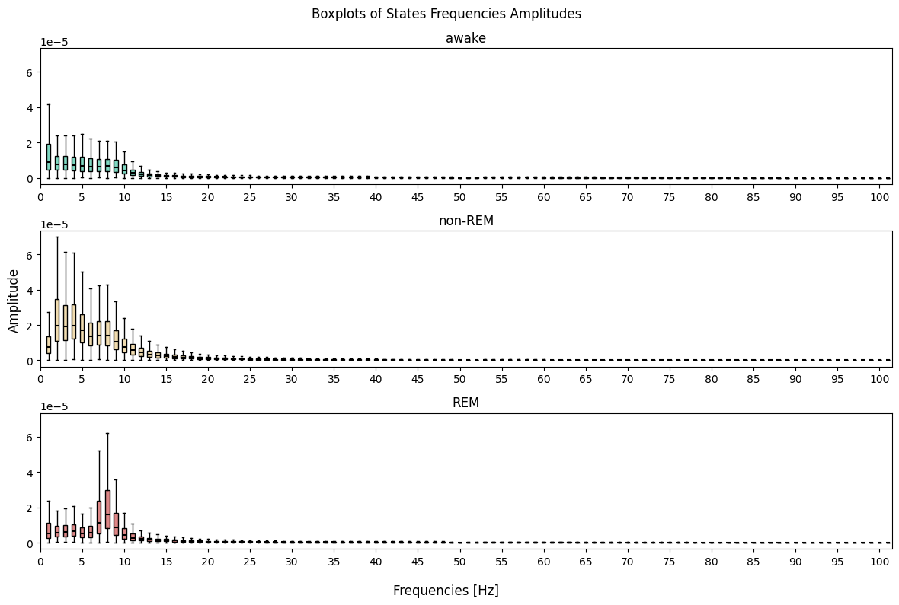

# Practical Work 3

## General

- Authors: Fabien Léger & Mauro Santos
- Course: ARN, HEIG-VD
- Teaching staff: Professor Stephan Robert & Assistant Yasaman Izadmehr
- Date: 27.03.2026

## Information

### Files

- EEG_mouse_data_1.csv - mouse number 1
- EEG_mouse_data_2.csv - mouse number 2
- EEG_mouse_data_test.csv - mouse number 3 (only for testing part 3)
- ...

### Guidelines

- 25 features
- Normalize data
- 3-fold cross validation (3 different instances with validation in each)
- Plot training and validation loss 
- Confusion matrix
- F1-score (of each class and ‘micro’, there is a parameter for « micro », check sklearn) 

## Notes

We explored a bit the data to better fit our algorithms. Here is a list of different steps done.

Firtly, by taking the same graph we did in practical work 1, we can check how the frequencies are distributes. We can
then try to find better faatures than take the first 25.

Thanks to this graph, it is pretty obvious that there is only a real difference between the first 10 frequencies. It
is probably possible to further reduce the number of features but we're gonna keep it as a good base for now.

## Part 1 - Separation awake/sleep

### Model

Firstly, we decided to group the two mice together to have a bigger dataset and mix the data more.

In this first part, we only classify mice states between awake and non-awake. We can do this by grouping n-rem and rem
sleep stages into "sleep" and have "awake" be the other group. Thanks to that, we can use a single neuron as output.

- output = 1 => 'w'
- output = 0 => 's'

We can then use the sigmoid function to normalize our data between 0 and 1. Then, a basic threshold at 0.5 to separate
our results obtained through the output neuron.

### Performances result

| Idx | Learning rate | Momentum | nb epochs | loss | Nb neurons | F1 (micro) | Notes |
|-----|---------------|----------|-----------|------|------------|------------|-------|
| 0   | 0.1           | 0.8      | 100       | mse  | 8          | 78.59%     |       |
| 1   | 0.01          | 0.9      | 100       | mse  | 16         | 76.79%     |       |
| 2   | 0.001         | 0.8      | 150       | mse  | 32         | 59.61%     |       |

### Training history plot

As we can see, the training went decently well with a gradual descent. The only real problem is the time it takes.
Because of that, it is quite hard to make tests on it. We could have batching to improve that time but this would be
implemented in part 3.

### Analysis of results

With only 2 outputs possible, it is quite easy to implement the code for it. Taking the first 25 features does help
a bit with the results. We can obtain 81% instead of 78%.

## Part 2 - Separation awake/rem/non-rem

### Model

### Testing

| Exp | Layers | Units     | Activation | Optimizer | LR     | Batch | Epochs | Loss                     | F1 (micro) | Notes  |
|-----|--------|-----------|------------|-----------|--------|-------|--------|--------------------------|------------|--------|
| 0   | 1      | [4]       | relu       | Adam      | 0.001  | 32    | 100    | categorical_crossentropy | 76.73%     |        |
| 1   | 1      | [16]      | relu       | Adam      | 0.001  | 32    | 100    | categorical_crossentropy | 83.95%     |        |
| 2   | 1      | [32]      | relu       | Adam      | 0.001  | 32    | 100    | categorical_crossentropy | 84.25%     |        |
| 3   | 1      | [64]      | relu       | Adam      | 0.001  | 32    | 100    | categorical_crossentropy | 84.55%     |        |
| 4   | 2      | [32, 16]  | relu       | Adam      | 0.001  | 32    | 100    | categorical_crossentropy | 84.47%     |        |
| 5   | 2      | [64, 32]  | relu       | Adam      | 0.001  | 32    | 100    | categorical_crossentropy | 84.36%     | deeper |
| 6   | 2      | [128, 64] | relu       | Adam      | 0.001  | 32    | 100    | categorical_crossentropy | 84.26%     |        |
| 7   | 2      | [16, 32]  | relu       | Adam      | 0.0005 | 32    | 100    | categorical_crossentropy | 84.30%     |        |
| 8   | 2      | [32]      | tanh       | Adam      | 0.001  | 32    | 100    | categorical_crossentropy | 84.21%     |        |
| 8   | 2      | [32]      | tanh       | Adam      | 0.001  | 32    | 100    | categorical_crossentropy | 84.21%     |        |

## Part 3 - Competition

### Ideas

- Batch
- More hidden layers