# Practical Work 3

## General

- Authors: Fabien Léger & Mauro Santos
- Course: ARN, HEIG-VD
- Teaching staff: Professor Stephan Robert & Assistant Yasaman Izadmehr
- Date: 27.03.2026

## Information

### Files

- EEG_mouse_data_1.csv - mouse number 1
- EEG_mouse_data_2.csv - mouse number 2
- EEG_mouse_data_test.csv - mouse number 3 (only for testing part 3)
- lab3_part1.ipynb - part 1 with awake/sleep
- lab3_part2.ipynb - part 2 with awake/rem/non-rem
- lab3_part3.ipynb - part 3 with optimizations
- test_pred.npy - results from part 3 using lab3_part3.ipynb with the best parameters we found

### Guidelines

- 25 features
- Normalize data
- 3-fold cross validation (3 different instances with validation in each)
- Plot training and validation loss 
- Confusion matrix
- F1-score (of each class and ‘micro’, there is a parameter for « micro », check sklearn) 

## Part 1 - Separation awake/sleep

### Model

Firstly, we decided to group the two mice together to have a bigger dataset and mix the data more.

In this first part, we only classify mice states between awake and non-awake. We can do this by grouping n-rem and rem
sleep stages into "sleep" and have "awake" be the other group. Thanks to that, we can use a single neuron as output.

- output = 1 => 'w'
- output = 0 => 's'

We can then use the sigmoid function to normalize our data between 0 and 1. Then, a basic threshold at 0.5 to separate
our results obtained through the output neuron.

<div style="page-break-before: always;"></div>

### Performance results

| Idx | Learning rate | Momentum | nb epochs | loss | Nb neurons | F1 (micro) | Notes |
|-----|---------------|----------|-----------|------|------------|------------|-------|
| 0   | 0.1           | 0.8      | 100       | mse  | 8          | 80.81%     |       |
| 1   | 0.01          | 0.8      | 100       | mse  | 16         | 68.58%     |       |
| 2   | 0.001         | 0.8      | 150       | mse  | 32         | 59.61%     |       |
| 3   | 0.5           | 0.8      | 200       | mse  | 8          | 81.99%     |       |
| 4   | 0.2           | 0.8      | 400       | mse  | 8          | 82.63%     |       |
| 5   | 0.2           | 0.8      | 1000      | mse  | 8          | 85.99%     |       |

It seems we get the best results with a high enough learning rate. We can higher the number of epoch to have a
better f1 score. This doesn't seem to learn the training data too much so it's not overfitting yet. One thing to
take into account is simply that it's not viable for now to train on such a long period of time.

Although the learning rate is quite high and seems to be not that stable at the start, it balances itself quickly.
A learning rate of 0.1 or 0.2 feels the right choice. Anything lower would make the training last years.

For the rest of this part, we will use the no5 as our baselines as 85% is already a good start.

### Training history plot

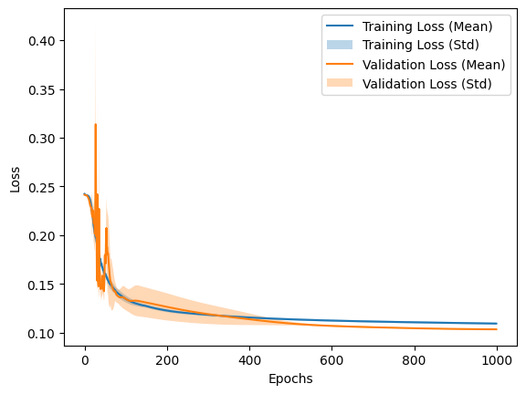

As we can see, the training went decently well with a gradual descent. The only real problem is the time it takes.
Because of that, it is quite hard to make tests on it. We could have batching to improve that time but this would be
implemented in part 3.

A strange aspect is that after 600 epochs we start to have better results for validation data than training. This
could be because our validation data is easier to guess or we simply learned it through our choice of parameters.

Again, there is a rapid descent for the first 200 epochs but it has a harder time later on. This could be improved
through other ways.

<div style="page-break-before: always;"></div>

### Analysis of results

With only 2 outputs possible, it is quite easy to implement the code for it. We can now check the confusion matrices
to see better how our model performs.


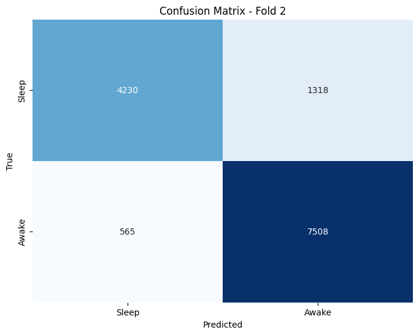

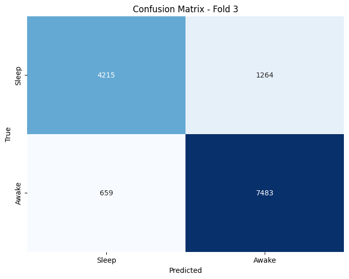

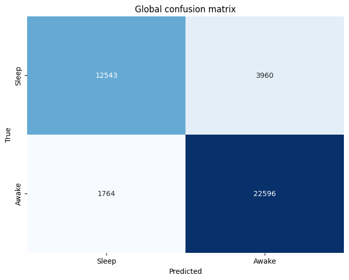

<div style="page-break-before: always;"></div>

- AccuracySleep = 12543 / (12543 + 3960) = 12543 / 16503 ≈ 0.760 = 76.0%
- AccuracyAwake = 22596 / (22596 + 1764) = 22596 / 24360 ≈ 0.928 = 92.8%

It is quite apparent even in the confusion matrices that when a mouseis awake, we guess mostly right with a 92.8%
accuracy. The problem comes from when it sleeps. We only have a success rate of 76.0% letting about 1/4 guesses
wrong. This is certainly what's pejorating our results.

Ways to improve this model are numerous. The problems range from a slow learning process to quite poor results even
with many epochs and decent parameters. We can hope to fix most of these problems in part3 with new ideas to
implement. It is worrying for part2 results because we only got so much f1 score already. We can predict it could
be lower because we have a new class or that the error will simply divide itself in the new class.

## Part 2 - Separation awake/rem/non-rem

### Model

This time, the goal is to have a similar model to part1 but separate it into 3 classes.

- max(output_neurons) = idx0 => 'w' (awake)
- max(output_neurons) = idx1 => 'r' (rem sleep)
- max(output_neurons) = idx2 => 'n' (non-rem sleep)

This means that we need 3 neurons as outputs. We can then have each neuron represent a class. The number we get per
neuron is how "sure" the algorithm is that it is effectively that class. As a final output, we can take the biggest
of those number to say of which class the data is from.

### Performance results

| Exp | Layers | Units     | Activation | Optimizer | LR     | Momentum | Epochs | Loss                     | F1 (micro) | Notes              |
|-----|--------|-----------|------------|-----------|--------|----------|--------|--------------------------|------------|--------------------|
| 0   | 1      | [32]      | relu       | Adam      | 0.1    | 0.8      | 100    | categorical_crossentropy | 87.52%     | Overfitting        |
| 1   | 1      | [32]      | relu       | Adam      | 0.01   | 0.8      | 100    | categorical_crossentropy | 88.02%     | Overfitting        |
| 2   | 1      | [4]       | relu       | Adam      | 0.001  | 0.8      | 100    | categorical_crossentropy | 87.59%     | No overfitting     |
| 3   | 1      | [16]      | relu       | Adam      | 0.001  | 0.8      | 100    | categorical_crossentropy | 88.10%     | Slight overfitting |
| 4   | 1      | [32]      | relu       | Adam      | 0.001  | 0.8      | 100    | categorical_crossentropy | 88.26%     | Slight overfitting |
| 5   | 1      | [64]      | relu       | Adam      | 0.001  | 0.8      | 100    | categorical_crossentropy | 88.21%     | Slight overfitting |
| 6   | 1      | [32]      | relu       | Adam      | 0.0005 | 0.8      | 100    | categorical_crossentropy | 88.14%     | No overfitting     |

We changed the loss and have pretty good result with a low learning rate and around 32 neurons.

We will keep the 88.14% as that's a good average for now and there was less overfitting than the other ones.

<div style="page-break-before: always;"></div>

### Training history plot

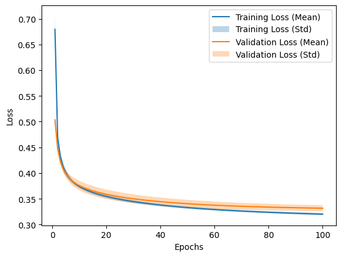

Thanks to the low learning rates and the other parameters, we have a good curve without interferences during the
descent. It seems likely that having a higher number of epochs would keep improving the micro f1 but this might
comes with overfitting. It's still a good result for the small tests we did.

We can see that the validation has a slightly higher loss. It's quite marginal though.

<div style="page-break-before: always;"></div>

### Analysis of results

Here are the confusion matrices for this stage.

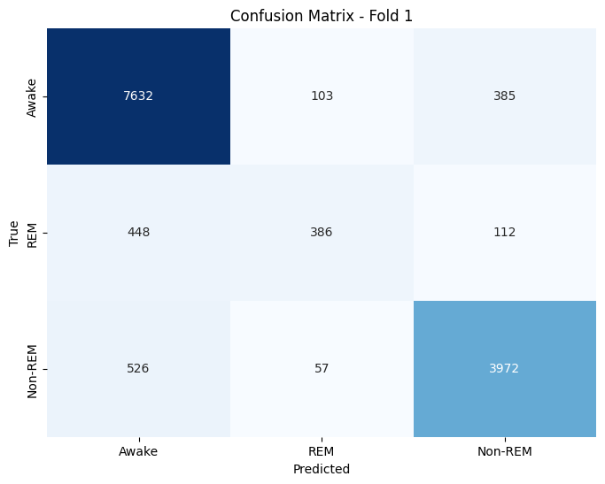


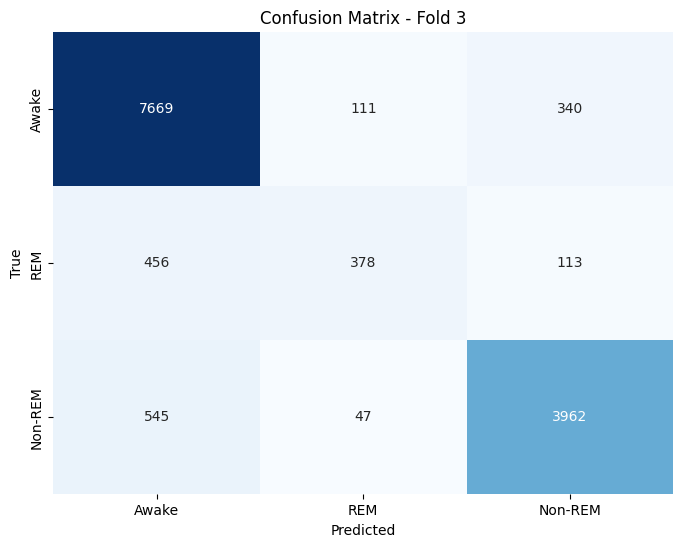


<div style="page-break-before: always;"></div>

Despite us having more classes to sort, we end up with a very good. It does seem our model prefers to say awake
probably because of the sheer number of awake hours for a mouse. We can see that we predict awake and get it 
wrong more than a 1000 times for both REM and non-REM stages. We could definitely improve this by giving more
weight to those in part3.

Another problem is still the time it takes. Thanks to a different loss value, we can have pretty good results
with less epochs. The problem is still that it takes a few minutes to test anything.

Although we have one more parameter, it does not seem to give way worse results than part1 which is a good
surprise. This may come from how we changed the model to have the 3 output neurons or the loss. Because of
that, we had to make a new batch of tests and made progress on that end.

## Part 3 - Competition

### Ideas

#### Feature selection

After further analysis of the data that was given to us, we noticed that the first 10 frequencies were the ones that had most noticeable changes during the different stages. Therefore, we decided to reduce the number of features to 10 instead of 25 in a hope to have a better performance and faster training time.


Thanks to this graph, it is pretty obvious that there is only a real difference between the first 10 frequencies. It
is probably possible to further reduce the number of features but might make the results worse.

#### Temporal learning

This was probably the ace up our sleeve. After a lot of looking around, we found that we could use the data from the previous epochs to better help train the current one. therefore we implemented it using the 4 previous epochs as input for the current one.

<div style="page-break-before: always;"></div>

#### Class weights

We noticed that the data was quite unbalanced with a lot more awake samples than sleep ones. Therefore, we decided to use class weights to give more importance to the sleep samples and try to balance the data a bit better. this makes it so that the model is penalized more when it makes a mistake on rem and not rem sleep samples.

We noticed in earlier sections that we couldn't guess sleep samples that well. This might come from
the sheer amount of awake samples. Thanks to this fix, we should be able to improve our micro f1 score.

#### Early stopping

To avoid overfitting and to save time, we implemented early stopping. This way, we can stop the training when the validation loss starts to plateau or increase, which is a sign that the model is starting to overfit the training data. When this happens, the training is stopped and the best model is saved.

#### Learning Rate Reduction

To further improve the training process, we implemented learning rate reduction. Which reduces the learning rate when the validation loss plateaus, allowing the model to more precisely tune its weights and potentially achieve better performance.

### Model

To implement the temporal learning we firstly added a function that allows us to to shift the data from the previous epochs to be used as input for the current epoch.

```python
temporal_window = 4
def make_past_context_features(X, window=4):
    # Builds [x(t-window), ..., x(t-1), x(t)] for each sample at time t
    n, d = X.shape
    context_parts = []
    for lag in range(window, 0, -1):
        shifted = np.empty_like(X)
        shifted[:lag] = X[0]
        shifted[lag:] = X[:-lag]
        context_parts.append(shifted)
    context_parts.append(X)
    return np.hstack(context_parts)

model_input_data = make_past_context_features(input_data, window=temporal_window)
```

This model input data is then used when training like so:
```python
fit_kwargs = dict(
    x=model_input_data,
    ...)
```

we also had to adapt the number of input features to 50 (our 10 features  * (number of previous epochs + current epoch))

<div style="page-break-before: always;"></div>

### Hyperparameters

```python
MODEL_CONFIG = {
    ##model parameters
  "input_dim": 50,
  "hidden_units": [32],
  ##training parameters
  "learning_rate": 0.1,
  "batch_size": 32,
  "epochs": 300,
  ## early stop parameters
  "early_stopping_patience": 15,
  ## learning rate reduction parameters
  "reduce_lr_patience": 5,
  "reduce_lr_factor": 0.5,
  "min_lr": 1e-5,
}
``` 

These hyperparameters were found by trying different combinations and analysing how the training history plot looked like. Thanks to some of our optimizations, we were able to take way less time training our model which allowed us to try more combinations.

### Workflow

In order to find our the best parameters, we did made a copy of the experiment used in part 2 and we added all the different ideas in order to get a better view of how each of them impacted the results. We then did a grid search on the different parameters to find the best combination of them. We also used the validation data to check the performance of our model and look for signs of overfitting.

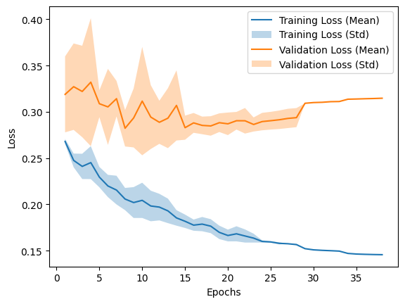

We ended up our training with a 0.90 micro f1-score using the same sets as in part 2.

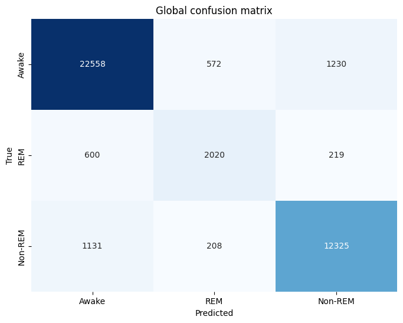

Those parameters would be copied on to the part 3 notebook so we could train with the whole data and generate the .npy file for the competitoin.

### Performance results

Our best model ended up with an accuracy of 0.92 with the training data and a loss of 0.1475 as seen below.

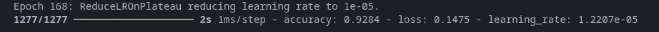

### Training history plot

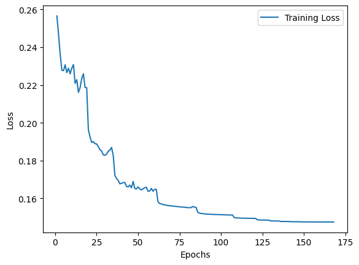

We got this training history plot that really shows the impact of reducing the learning rate and early stopping, allowing us to both start with higher learn rates and also still converge quite fast.

### Analysis of results

We got a pretty high accuracy score for the training data, which is a good sign that our model is learning well, but might also be a sign of overfitting and since we don't have the test data labels, it's hard to know for sure.

## Conclusion

Through this lab, we saw how to classify with a single neuron into 2 classes and how to do multi-classing thanks to multi-neuron outputs.
We had to search through different parameters to find way to lower the loss through time both quickly but also with good results. It is
also important to try different tools to try and improve the model.

We could have improved this model even further, but it was mainly a tool to learn the different aspects of making a neuron network. It
seems obvious now that some things were wrongly done. Especially, we did not write our initial tests with our parameters down. During this
early phase, we got some really good results around 90% f1. The best way would have been to make a report from the start to retrieve all
our foundings and make a dataset of possible parameters.

Despite the problems, we ended up making a functional prediction algorithm.

## AI disclaimer

The code delivered in this practical work was highly AI assisted. We mainly used AI to help us adapt the code from the previous practical works to more quickly be able to get into the interesting part of the lab. It is important to note no AI was used to write this report and all the code was supervised by us. The choice of parameters was also part of our work finetuning the model to get better results.